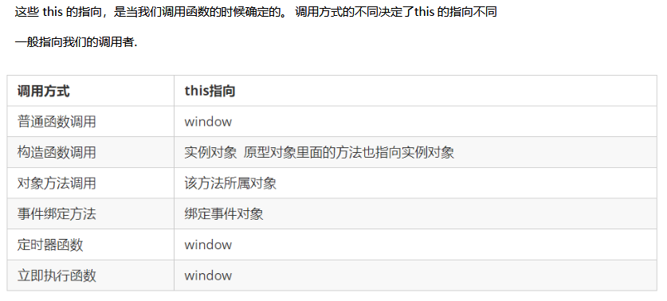

# 继承

```
ES6之前并没有给我们提供extends 继承。我们可以通过构造函数+原型对象模拟实现继承，被称为组合继承。
```

```
call()

调用这个函数, 并且修改函数运行时的this 指向

fun.call(thisArg, arg1, arg2, ...);call把父类的this指向子类

thisArg ：当前调用函数this 的指向对象

arg1，arg2：传递的其他参数
```

**利用构造函数实现子类的继承：**

## **属性的继承**

```
function Father (uname,age) {
			// this指向父类的实例对象
			this.uname = uname;
			this.age = age;
			// 只要把父类的this指向子类的this既可
		}
		function Son (uname, age,score) {
			// this指向子类构造函数
			// this.uname = uname;
			// this.age = age;
			// Father(uname,age);
			Father.call(this,uname,age);
			this.score = score;
		}
		Son.prototype.sing = function () {
			console.log(this.uname + '唱歌')
		}
		var obj = new Son('刘德华',22,99);
		console.log(obj.uname);
		console.log(obj.score);
		obj.sing();
```

## **方法的继承：**

**实现方法把父类的实例对象保存给子类的原型对象**

```
一般情况下，对象的方法都在构造函数的原型对象中设置，通过构造函数无法继承父类方法。核心原理：

①将子类所共享的方法提取出来，让子类的prototype 原型对象= new 父类()  

②本质：子类原型对象等于是实例化父类，因为父类实例化之后另外开辟空间，就不会影响原来父类原型对象

③将子类的constructor 

把父类的实例对象赋值给子类的原型
```

```
function Father () {

		}
		Father.prototype.chang = function () {
			console.log('唱歌');
		}

		function Son () {

		}
		// Son.prototype = Father.prototype;
		Son.prototype = new Father();
		var obj = new Son();
		obj.chang();

		Son.prototype.score = function () {
			console.log('考试');
		}

		// obj.score();
		// console.log(Son.prototype);
		console.log(Father.prototype);
```

**注意：一定要让Son指回构造函数**

```
实现继承后，让Son指回原构造函数

Son.prototype = new Father();

Son.prototype.constructor = Son;
```

**总结：用构造函数实线属性继承，用原型对象实线方法继承**

# 类的本质

```
class本质还是function

类的所有方法都定义在类的prototype属性上

类创建的实例,里面也有__proto__ 指向类的prototype原型对象

所以ES6的类它的绝大部分功能，ES5都可以做到，新的class写法只是让对象原型的写法更加清晰、更像面向对象编程的语法而已。

所以ES6的类其实就是语法糖.

语法糖:语法糖就是一种便捷写法.   简单理解, 有两种方法可以实现同样的功能, 但是一种写法更加清晰、方便,那么这个方法就是语法糖
```

```
	class Star {}
	console.log( typeof Star );
	var obj = new Star();
	console.log(obj.__proto__);
	console.log(Star.prototype);
```

课程回顾：

​	创建对象：字面量，构造函数，自定义构造函数

​	new：创建新的对象，tihs指向这个对象，把函数代码执行，返回这个对象

​	成员：静态成员，实例成员

​	属性：构造函数

​	方法：原型对象，prototype，共享方法

​	实例对象；____proto____，指向原型对象

​	构造函数：constructor，指回构造函数本身

​	原型链：当一个对象查找属性或者方法时的一个机制，方法

​	继承：组合继承：构造函数，原型对象

​	属性继承：调用父类的函数，用call改变this的指向

​	方法继承：把父类的实例对象赋值给子类的原型对象，用constructor指回构造函数

​	新增数组方法：forEach，filter，some


# ES5 中的新增方法

```
ES5 中给我们新增了一些方法，可以很方便的操作数组或者字符串，这些方法主要包括：

数组方法

字符串方法
```

## 数组方法：

```
迭代(遍历)方法：forEach()、map()、filter()、some()、every()；

这些方法都是遍历数组的
```

**forEach()**

```
array.forEach(function(currentValue, index, arr))遍历数组

currentValue：数组当前项的值
index：数组当前项的索引
arr：数组对象本身
```

```
var arr = ['red','blue','yellow','orange'];

arr.forEach(function (elm,i,arrAbc) {
	console.log(elm,i,arrAbc);
});

```

**filter()**

```
array.filter(function(currentValue, index, arr))

filter() 方法创建一个新的数组，新数组中的元素是通过检查指定数组中符合条件的所有元素,主要用于筛选数组

注意它直接返回一个新数组

currentValue: 数组当前项的值

index：数组当前项的索引

arr：数组对象本身回调函数里面添加return添加返回条件
```

```
var arr = [100,66,99,123,333,33,44,66];
	var reArr = arr.filter(function (elm, a, n) {

	// console.log(elm,a, n);
	return elm % 2 == 0;

	});

	console.log(reArr);
```

**some()**

```
array.some(function(currentValue, index, arr)) 【注意：找到或者满足条件立刻停止】

some() 方法用于检测数组中的元素是否满足指定条件. 通俗点查找数组中是否有满足条件的元素

注意它返回值是布尔值, 如果查找到这个元素, 就返回true , 如果查找不到就返回false.

如果找到第一个满足条件的元素,则终止循环. 不在继续查找.

currentValue: 数组当前项的值index：数组当前项的索引

arr：数组对象本身
```

```
var arr = [100,200,300,400];
var re = arr.some(function (elm,i,arr) {
		// console.log(elm,i,arr);
		console.log(i);
		return elm >= 200;
	});
console.log(re);
```

课程回顾：

​	new执行，静态成员，实例成员

​	 构造函数放属性，原型对象放方法

​	**原型对象：是构造函数的一个数【prototype】，放方法**

​	**对象原型：是对象的一个属性【proto】，指向原型对象**

​	**构造函数：constructor，指回构造函数本身**

​	**原型链：查找成员提供了方向，机制**

​	**继承：组合继承：构造函数+原型对象**

​	类的本质：function

​	**数组方法：forEach，filter，some**

​	字符串方法：trim

# 查询商品案例

```
1.把数据渲染到页面中(forEach)【insertAdjacentHTML】

 var tbody = document.querySelector('tbody');
        data.forEach(function (ele,  i) {
        	// console.log(ele);
        	var tr = '<tr><td>' + ele.id +'</td><td>' + ele.pname + '</td><td>' + ele.price + '</td></tr>';
        	tbody.insertAdjacentHTML('beforeend',tr);

        });

2.根据价格显示数据

 var btn = document.querySelector('.search-price');
        var start = document.querySelector('.start');
        var end = document.querySelector('.end');
        btn.onclick = function () {
        	var reArr = data.filter(function (ele, i) {
        		return start.value <= ele.price && ele.price <= end.value;
        	});
        	tbody.innerHTML = '';s
        	reArr.forEach(function (ele) {
        	var tr = '<tr><td>' + ele.id +'</td><td>' + ele.pname + '</td><td>' + ele.price + '</td></tr>';
        	tbody.insertAdjacentHTML('beforeend',tr);
        });
        };

3.根据商品名称显示数据
var sele = document.getElementById('sele');
        sele.onchange = function () {
       		var n = [];
        	var id = sele.value;
        	data.some(function (ele) {
        		if (id == 0) {
        			n = data;
        			return true;
        		}else if (ele.id == id) {
        			n.push(ele);
        			return true;
        		}
        	});
        	
        	tbody.innerHTML = '';
	        	n.forEach(function (ele, i) {
	        	// console.log(ele);
	        	var tr = '<tr><td>' + ele.id +'</td><td>' + ele.pname + '</td><td>' + ele.price + '</td></tr>';
	        	tbody.insertAdjacentHTML('beforeend',tr);
       		 });
        }
        
        
        
        
        必做题：求这个是数组所有数的和，求数组最大值和最小值，及最大值的下标和最小值的下标;
       var arr = [[123,45,66],[1234,23,45,56,67],[435,67,78,43,67,78,673,34]]
```

# 字符串方法：

```
str.trim()

trim：删除字符串两侧的空白符
```


# 函数进阶

## 函数的定义和调用

1. 函数声明方式function 关键字(命名函数)

2. 函数表达式(匿名函数)【自调用函数】

3. ```
    new Function()   var fn = new Function('参数1','参数2'..., '函数体')
    
    var fn = new Function('a','b','console.log(a,b);');
      
   fn(123,456);
   

   ```
   
4. Function 里面参数都必须是字符串格式

5. 第三种方式执行效率低，也不方便书写，因此较少使用

6. 所有函数都是Function 的实例(对象) 

7. 函数也属于对象

## 函数的调用方式

函数定义：命名函数，匿名函数

调用函数：好多种

```
1. 普通函数【fn()】
2. 对象的方法【对象.方法()】
3. 构造函数【new Fn()】
4. 绑定事件函数【obj.onclick = function () {}】
5. 定时器函数【window.setInterval(function () {},1000)】
6. 立即执行函数【(function () {})()】
```

```
		// function fn () {}
		// fn();

		// 方法
		// var obj = {
		// 	taiji : function () {}
		// }
		// obj.taiji();

		// 构造函数
		// function Person () {}
		// new Person();
			
		// 绑定事件
		// btn.onclick = function () {}

		// 定时器
		// window.setInterval(function () {},1000);

		// 自调用函数
		// (function () {})();
```


# this指向

```
this：指向调用者
```




​	

# 改变函数内部this 指向


```
JavaScript 为我们专门提供了一些函数方法来帮我们更优雅的处理函数内部this的指向问题，常用的有bind()、call()、apply() 三种方法。
```

## call 方法

```
call() 方法调用一个对象。简单理解为调用函数的方式，但是它可以改变函数的this指向。

fun.call(thisArg, arg1, arg2, ...)
thisArg：在fun 函数运行时指定的this 值

arg1，arg2：传递的其他参数

返回值就是函数的返回值，因为它就是调用函数

function Father () {this}
function Son () { Father.call(this,1,2) }

因此当我们想改变this 指向，同时想调用这个函数的时候，可以使用call，比如继承
```

## apply 方法

```
fun.apply(thisArg, [argsArray]):调用函数

thisArg：在fun函数运行时指定的this值

argsArray：传递的值，必须包含在数组里面

返回值就是函数的返回值，因为它就是调用函数

因此apply 主要跟数组有关系，比如使用Math.max() 求数组的最大值

var obj = {name : '张三丰'}
	function fn (arr) {
		console.log(this);
		console.log(arr);
		console.log(arr2);
	}


	//#################################################
	var arr = [23,45,56,23,54];

	var n = Math.max.apply(null,arr);

	console.log(n);
```

## bind 方法

```
bind() 方法不会调用函数。但是能改变函数内部this 指向

fun.bind(thisArg, arg1, arg2, ...)

thisArg：在fun 函数运行时指定的this 值

arg1，arg2：传递的其他参数

返回由指定的this 值和初始化参数改造的原函数拷贝

因此当我们只是想改变this 指向，并且不想调用这个函数的时候，可以使用bind


var btn = document.querySelector('input');

		btn.onclick = function () {
			this.disabled = true;
			window.setTimeout(function () {
				this.disabled = false;
			}.bind(btn),2000);
	}
```

## call  apply  bind 总结

```
fun.call(obj,arg1,arg2......);
fun.apply(obj,[a,b,c])
fun.bind(obj,arg1,arg2......);

```


```
相同点:  都可以改变函数内部的this指向.

区别点:  
1.call 和apply  会调用函数, 并且改变函数内部this指向.
2.call 和apply 传递的参数不一样, call 传递参数aru1, aru2..形式apply 必须数组形式[arg]
3.bind  不会调用函数, 可以改变函数内部this指向

主要应用场景:  
1.call 经常做继承. 
2.apply 经常跟数组有关系.比如借助于数学对象实现数组最大值最小值
3.bind  不调用函数,但是还想改变this指向. 比如改变定时器内部的this指向
```

# 严格模式

JS：两种模式[类似于HTML版本]

​	1、正常模式

​	2、严格模式

```
什么是严格模式

JavaScript 除了提供正常模式外，还提供了严格模式（strictmode）。ES5 的严格模式是采用具有限制性JavaScript 变体的一种方式，即在严格的条件下运行JS 代码。
严格模式在IE10 以上版本的浏览器中才会被支持，旧版本浏览器中会被忽略。
严格模式对正常的JavaScript 语义做了一些更改：

1.消除了Javascript语法的一些不合理、不严谨之处，减少了一些怪异行为。【例如变量，不声明就报错】
2.消除代码运行的一些不安全之处，保证代码运行的安全。
3.提高编译器效率，增加运行速度。
4.禁用了在ECMAScript的未来版本中可能会定义的一些语法，为未来新版本的Javascript做好铺垫。比如一些保留字如：class, enum, export, extends, import, super 不能做变量名
```

## 开启严格模式

开启严格模式："use strict"

```
	<script>"use strict"</script>：脚本开启严格模式
	<script>function fn () {"use strict"}</script>为函数开启严格模式
```


```
严格模式可以应用到整个脚本或个别函数中。因此在使用时，我们可以将严格模式分为为脚本开启严格模式和为函数开启严格模式两种情况。
```

**为脚本开启严格模式**

```
为整个脚本文件开启严格模式，需要在所有语句之前放一个特定语句“use strict”;（或‘use strict’;）。

<script>
	"use strict";
	console.log("这是严格模式。");
</script>

因为"use strict"加了引号，所以老版本的浏览器会把它当作一行普通字符串而忽略。
```

**为函数开启严格模式**

```
要给某个函数开启严格模式，需要把“use strict”;  (或'use strict'; ) 声明放在函数体所有语句之前。

function fn(){"use strict";return "这是严格模式。";}

将"use strict"放在函数体的第一行，则整个函数以"严格模式"运行。
```

## 严格模式中的变化

```
严格模式对Javascript的语法和行为，都做了一些改变。

```

**变量规定**

​	**********变量申明必须加var，而且不准删除变量

```
在正常模式中，如果一个变量没有声明就赋值，默认是全局变量。严格模式禁止这种用法，变量都必须先用var命令声明，然后再使用。
n = 3;
严禁删除已经声明变量。例如，delete x; 语法是错误的。
```

**严格模式下this 指向问题**

​	*********：严格模式下，普通函数this是undefined

```
以前在全局作用域函数中的this 指向window 对象。
严格模式下全局作用域中函数中的this是undefined。

其他的没有变化：
以前构造函数时不加new也可以调用,当普通函数，this 指向全局对象
严格模式下,如果构造函数不加new调用, this 指向的是undefined 如果给他赋值则会报错
new 实例化的构造函数指向创建的对象实例。
定时器this 还是指向window 。
事件、对象还是指向调用者。
```

**函数变化**

​	参数不能重名

```
函数不能有重名的参数。

函数必须声明在顶层.新版本的JavaScript 会引入“块级作用域”（ES6 中已引入）。为了与新版本接轨，不允许在非函数的代码块内声明函数。【if，for等里面定义函数也不可以，但是现在不可以】

更多严格模式要求参考：https://developer.mozilla.org/zh-CN/docs/Web/JavaScript/Reference/Strict_mode

错误写法:
function fn (a,a) {console.log(a+a);}
fn(1,2);

```

上午回顾：

​	字符串：trim

​	函数定义：命名函数，匿名函数，new Function

​	函数调用：普通函数，事件处理程序，构造函数，方法，定时器，自定义函数

​	this：this指向调用者

​	改变this指向：call，apply，bind

​	严格模式：'use strict';

​	高阶函数：把函数当做参数或者返回值操作的函数，称为高阶函数

# 高阶函数

```
高阶函数是对其他函数进行操作的函数，它接收函数作为参数或将函数作为返回值输出。

把函数作为参数，或者把函数作为返回值的的函数，称为高阶函数
```

```
此时fn就是一个高阶函数

函数也是一种数据类型，同样可以作为参数，传递给另外一个参数使用。最典型的就是作为回调函数。

同理函数也可以作为返回值传递回来

<script>
	function fn(callback){
		callback&&callback();
	}
	fn(function(){
		alert('hi')
	})
</script>


<script>
	function fn(){
		return function() {}
	}
	fn();
</script>
```

# 闭包

## 变量作用域

```
变量根据作用域的不同分为两种：全局变量和局部变量。

1. 函数内部可以使用全局变量。
2. 函数外部不可以使用局部变量。
3. 当函数执行完毕，本作用域内的局部变量会销毁。
```

## **什么是闭包**

**闭包作用：延伸变量的作用范围。**

```
闭包（closure）指有权访问另一个函数作用域中变量的函数。【很多种解释，都并不权威】

简单理解就是，一个作用域可以访问另外一个函数内部的局部变量。

<script>
	function fn1(){
		// fn1 就是闭包函数
		var num = 10;
		function fn2(){
			console.log(num); // 10
		}
		fn2()
	}
	fn1();
</script>
```

**思考：如何再函数外面访问到函数内部的变量**

```
function fn () {

		var i = 7;
		return function () {
			console.log(i);
		}
		// function fn1 () {
		// 	console.log(i);
		// }
		// fn1();
	}
	var n = fn();
n();
```

**练习：**

```
注册事件练习：打印索引值
var lis = document.querySelectorAll('li');

	for (var i = 0; i < lis.length; i++) {

		(function (index) {
			lis[index].onclick = function () {
				console.log(index);
			}
		})(i);

}


思考题：
var name = "The Window";
   var object = {
     name: "My Object",
     getNameFunc: function() {
     return function() {
     return this.name;
     };
   }
 };
console.log(object.getNameFunc()())
----------------------------------------------------------------------------------------
var name = "The Window";　　
  var object = {　　　　
    name: "My Object",
    getNameFunc: function() {
    var that = this;
    return function() {
    return that.name;
    };
  }
};
console.log(object.getNameFunc()())
```


